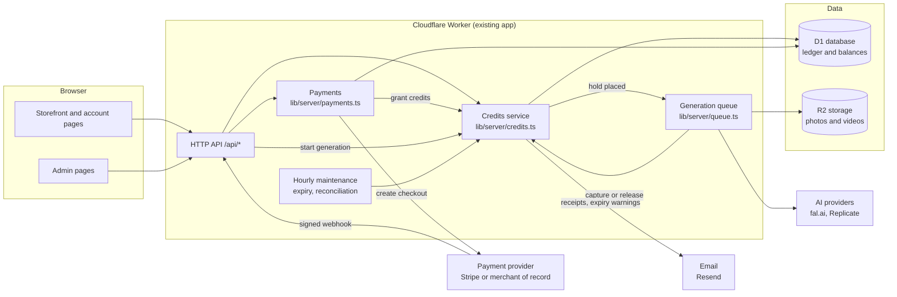
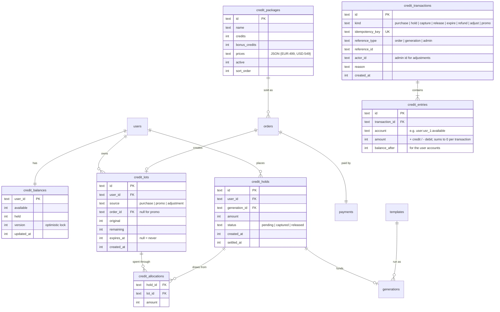
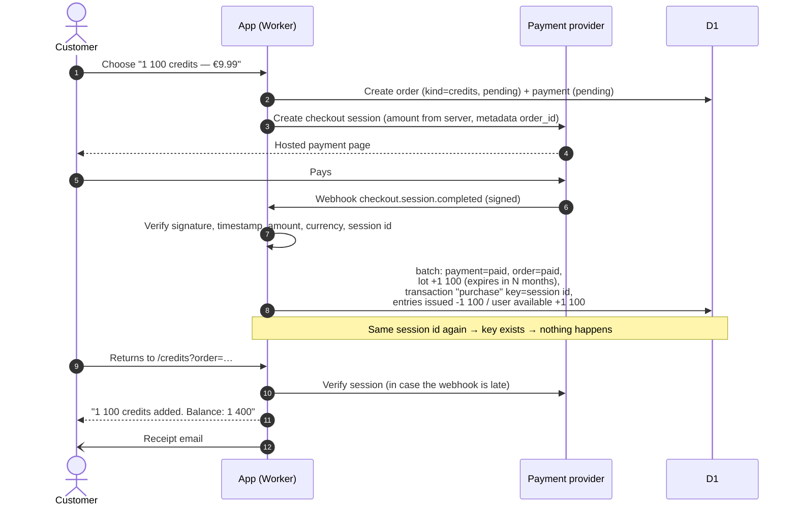
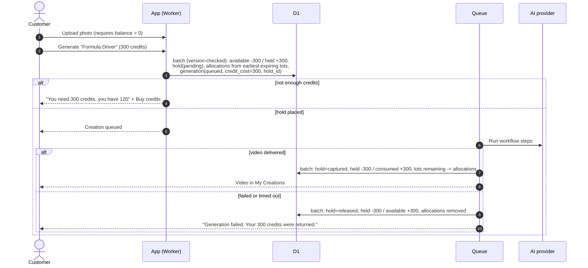
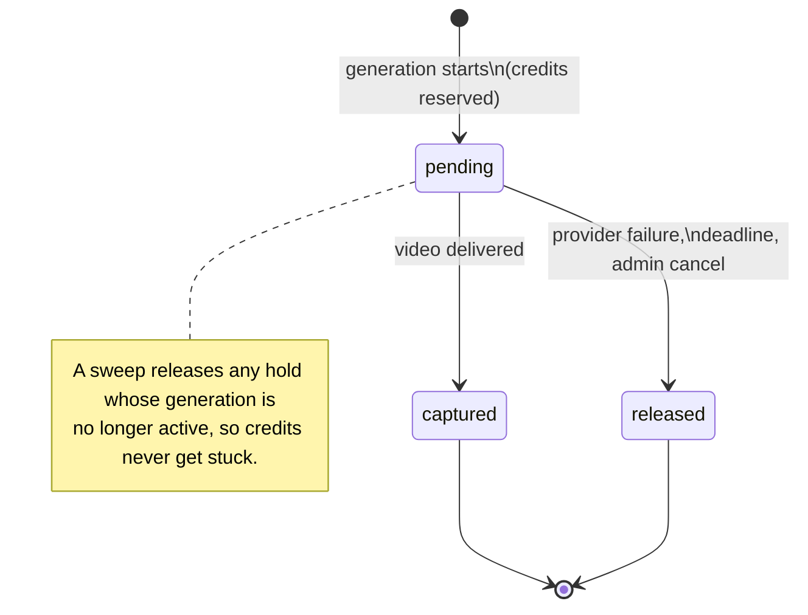
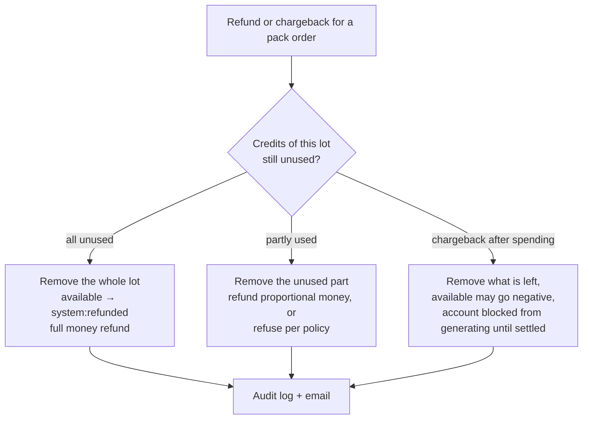
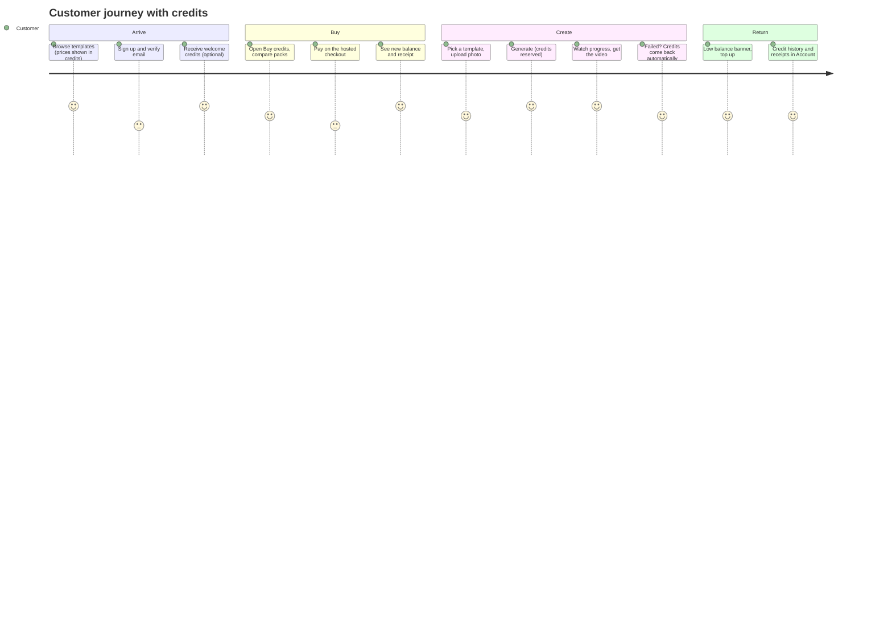

# Credits system — architecture design

Status: **design proposal, not implemented.** Date: 6 October 2026.
Scope: let a signed-in customer buy credit packs and spend credits on template video generations. This document covers the rules, data model, connections, flows, user and admin journeys, safety, accounting and migration. Code comes later.

---

## 1. Summary of the design

| Decision | Choice | Why |
|---|---|---|
| What the customer buys | **Credit packs** (e.g. 500 credits) through a one-time checkout | Same pattern as OpenAI prepaid credits, Runway and Kling top-ups |
| What a template costs | A whole number of **credits per generation**, set by the admin | Customers see one simple number; you keep pricing control |
| Where credits are tracked | **Our own ledger in D1**, not in the payment provider | The provider only takes money; generation logic, holds and refunds live with us |
| Ledger style | **Append-only entries, double-entry**, plus a cached balance per user | Industry standard for money-like balances (Modern Treasury) |
| Spending | **Hold → capture / release**: credits are reserved when generation starts, charged when the video is delivered, returned automatically if it fails | Like a card authorization; failed generations never cost the customer (Kling does the same) |
| Expiry | Each purchase is its own **lot** with its own expiry; spending uses the lot that expires first | OpenAI (1 year per purchase), Kling (2 years, shortest-validity first) |
| Refund of money | Unused credits of a pack can be refunded; used credits cannot | Matches OpenAI/Kling "non-refundable except…" policies |
| Payment provider | Behind the existing `PaymentGateway` interface; **Stripe or a merchant of record** | Stripe does not officially support Albanian businesses (see §12) |
| Integers only | Credits and money are stored as integers (credits, minor currency units) | No rounding errors |

Everything below follows from these choices.

---

## 2. What the big companies do (research)

| Company | How credits work | What we take from it |
|---|---|---|
| **OpenAI API** (prepaid billing) | Buy credits up front. **Each purchase is a separate grant with its own expiry, 1 year after purchase.** Credits are non-refundable except for billing errors, unauthorized use or service failure. | Lots with per-purchase expiry; clear refund policy |
| **Stripe Billing credits** | A **Credit Grant** tracks prepaid or promotional credits for a customer, optional `expires_at`, and a ledger "tracks every credit-related action". Credits apply to metered **subscription invoices** only; unapplied grants can be voided. | Confirms the grant + ledger model. Not usable directly for us: it is tied to subscription invoices, and our credits are spent by our own queue |
| **Runway** (AI video) | Credits per **second of video per model** (e.g. 5–40 credits/second). Plan credits reset monthly; separately purchased credits reported not to expire. | Cost can depend on duration/model; keep it per template for simplicity |
| **Kling** (AI video) | **Failed generations refund their credits.** Purchased credits valid **2 years**; credits are **spent shortest-validity first**; no cash-out. | Automatic refund on failure; spend-order rule |
| **Modern Treasury** (ledger infrastructure) | Every transaction has balanced debit/credit entries. Entries are **pending, posted or archived**; accounts have **pending, posted and available** balances. **Balances are never edited directly**, only by writing entries. Posted entries are immutable. Optimistic **locking on account version** prevents double-spend. | The core ledger and hold design in §5–§7 |
| **Stripe Checkout fulfillment** | Fulfill on `checkout.session.completed` and check `payment_status = paid`; handle delayed payment methods; **fulfillment must be idempotent** because the event can arrive several times, even concurrently. | Credits are granted exactly once per payment, keyed by the checkout session |

Sources are listed in §16.

---

## 3. Rules of the credit system

1. **Credit unit.** 1 credit is a unit of service, not money. Display: "500 credits". Suggested anchor: 1 credit ≈ €0.01 at the base pack price, so prices stay readable.
2. **Packs.** Admin-defined, e.g. 500 credits for €4.99, 1 100 for €9.99 (+10% bonus), 3 000 for €24.99 (+20%). A pack has a price per currency.
3. **Template cost.** Each template has `credit_cost`, e.g. Formula Driver = 300 credits. The cost is **snapshotted** on the generation when it starts, so later price edits never change a running job.
4. **Can I generate?** Only if `available ≥ credit_cost`. Uploading photos also requires a positive balance (as you decided), which removes most abandoned uploads.
5. **Spend order.** Promotional credits first, then purchased lots, each by earliest expiry (the Kling rule).
6. **Failed generation.** The hold is released; the customer gets every credit back, automatically.
7. **Expiry.** Purchased lots expire after N months (open decision, §15). Promotional/welcome credits expire sooner (e.g. 30 days). Customers are warned before expiry.
8. **No cash-out, no transfer** between accounts.
9. **Money refunds.** A pack can be refunded only for its **unused** part (or under consumer law; see §12). Refunding a pack removes its remaining credits first.
10. **Admin adjustments** (gifts, goodwill, corrections) are ledger entries with a reason and the admin's id, never direct edits.

---

## 4. System architecture



**What is new:** the credits service and its tables. **What is reused:** authentication, uploads, the checkout and webhook code (signature check, replay protection, refunds), the queue, AI providers, storage and the admin panel.

The credits service is the **only** code allowed to change credit balances. Every other module calls it.

---

## 5. Data model

### 5.1 Ledger accounts

Double-entry means every movement takes credits *from* one account *to* another, and the total of all accounts is always zero. That makes mistakes detectable.

| Account | One per | Meaning |
|---|---|---|
| `user:<id>:available` | user | Credits the user can spend |
| `user:<id>:held` | user | Credits reserved by running generations |
| `system:issued` | system | Source of purchased credits (goes negative as credits are sold) |
| `system:promo` | system | Source of free/welcome/goodwill credits |
| `system:consumed` | system | Credits spent on delivered videos |
| `system:expired` | system | Credits that expired unused |
| `system:refunded` | system | Credits removed by a money refund or chargeback |

### 5.2 Tables



Changes to existing tables:

| Table | Change |
|---|---|
| `templates` | add `credit_cost` (integer) |
| `generations` | add `credit_cost` (snapshot) and `hold_id`; drop the per-video price for new jobs |
| `orders` | add `kind` (`credits` or the old `video`), `package_id`, `credits`; make `generation_id` optional, since a pack order has no generation |
| `payments`, `refunds`, `webhook_events` | reused unchanged for pack purchases |

### 5.3 Invariants (checked by tests and by an hourly reconciliation job)

1. The entries of every transaction sum to **0**.
2. `credit_balances.available` = sum of entries on `user:<id>:available`; same for `held`.
3. `available ≥ 0` and `held ≥ 0`, except a negative `available` created **only** by a chargeback after spending (§7.5).
4. Sum of `remaining` across a user's non-expired lots = `available + held`.
5. Every `idempotency_key` appears once, so a retried webhook or double-click can never grant or charge twice.
6. Entries are **insert-only**: never updated or deleted. A correction is a new transaction.

---

## 6. Concurrency and atomicity on D1

D1 is SQLite, without `SELECT … FOR UPDATE`. The design uses the two tools the app already relies on:

- **`db.batch([...])` runs statements in one transaction.** Either all of a credit movement is written or none of it is.
- **Conditional writes with a version check.** This is the Modern Treasury "lock on account version" idea:

```sql
-- 1. Move credits from available to held only if enough are available and nobody changed the balance meanwhile.
UPDATE credit_balances SET available = available - :cost, held = held + :cost, version = version + 1
 WHERE user_id = :user AND available >= :cost AND version = :expected;
-- 2..n. Every other insert in the batch is guarded, so it only happens if step 1 changed a row:
INSERT INTO credit_holds (...) SELECT ... WHERE EXISTS
 (SELECT 1 FROM credit_balances WHERE user_id = :user AND version = :expected + 1);
```

If step 1 changes no row (not enough credits, or a concurrent spend), the guarded inserts do nothing. The server re-reads the balance and either retries once or returns "Not enough credits". Two tabs clicking Generate at the same moment can therefore never overspend.

---

## 7. Flows

### 7.1 Buying a pack



### 7.2 Generating a video



The generation queue already has leases, retries and a 30-minute deadline. The only change is that "paid" now means "has a pending hold", and completion or failure calls `capture` or `release`.

### 7.3 Hold lifecycle



### 7.4 Expiry (hourly maintenance)

1. Find lots with `expires_at < now` and `remaining > 0` that have **no pending allocation**.
2. For each lot: one transaction "expire", available `-remaining` → `system:expired`; set `remaining = 0`.
3. 7 days and 1 day before expiry: email "You have 400 credits expiring on 12 March".

### 7.5 Refunds and chargebacks of a pack



The existing webhook handling for `charge.refunded` and `refund.updated` is reused; it calls the credits service instead of cancelling a single video. Disputes (`charge.dispute.created`) are added, which also closes an open TODO item.

### 7.6 Admin adjustment

Admin enters a user, an amount (+/−) and a reason, and confirms with their password. That writes a transaction `adjust` with `actor_id` and the reason: positive amounts come from `system:promo`, negative ones go to `system:refunded`. The adjustment appears in the audit log and in the user's history.

---

## 8. User journey



**Screens to build or change**

| Screen | Content |
|---|---|
| Header | Credit balance badge ("1 400 credits") linking to Buy credits |
| `/credits` (new) | Packs with bonus labels, current balance, what each pack buys ("≈ 4 Formula Driver videos") |
| Template page | "Generate — 300 credits"; if short: "You need 180 more credits" with a Buy button that returns here after payment |
| My Creations | "300 credits reserved" while processing; "300 credits returned" on failure |
| Account → Credits (new) | Balance, held credits, expiring soon, full history (purchase, spend, refund, expiry, gift), receipts |

---

## 9. Admin journey

| Page | What the admin does |
|---|---|
| **Credit packs** (new) | Create/edit packs: credits, bonus, price per currency, active, order |
| **Templates** | Set `credit_cost`. The margin helper shows provider cost vs credit value: *value = credit_cost × (pack price ÷ pack credits)* |
| **Users** | See a user's balance and history; add or remove credits with a reason |
| **Credit ledger** (new) | Search transactions by user, type, order or generation; export CSV |
| **Dashboard** | Credits sold, spent, expired and outstanding (the liability); revenue per pack; average credits per video |
| **Operations** | Reconciliation status (invariants of §5.3), holds older than the deadline, negative balances |

---

## 10. API surface

| Method & path | Who | Purpose |
|---|---|---|
| `GET /api/credits` | user | Balance (`available`, `held`), expiring-soon summary |
| `GET /api/credits/history?page=` | user | Paginated ledger entries for the user |
| `GET /api/credit-packages` | public | Active packs and prices |
| `POST /api/credits/checkout` | user | `{packageId, currency, idempotencyKey}` → checkout URL |
| `POST /api/credits/orders/:id/verify` | user | Confirms a returned checkout if the webhook is late |
| `POST /api/generations` | user | `{templateId, uploadIds, idempotencyKey}` → places the hold and queues the job (replaces per-video checkout) |
| `POST /api/webhooks/stripe` (or provider) | provider | Existing endpoint, extended for packs and disputes |
| `GET/POST/PATCH /api/admin/credit-packages` | admin | Manage packs |
| `POST /api/admin/users/:id/credits` | admin | Adjustment `{amount, reason, currentPassword}` |
| `GET /api/admin/credits/ledger` | admin | Search and export |
| `GET /api/admin/credits/reconciliation` | admin | Invariant check results |

Every money-changing endpoint takes an **idempotency key**, reusing the pattern of today's checkout endpoint.

---

## 11. Safety and abuse

| Risk | Protection |
|---|---|
| Double charge or double grant | Idempotency keys (unique index) on every credit transaction; webhook event ids stored |
| Two tabs spending at once | Version-checked conditional update (§6) |
| Credits stuck in "held" | Holds released by the queue on failure plus a sweep of holds whose generation is no longer active |
| Balance drift / bugs | Insert-only entries, double-entry zero-sum, hourly reconciliation with an admin alert |
| Card testing / fraud | Email verification before buying, per-user purchase rate limit, provider fraud tools (Stripe Radar), pack size limits for new accounts |
| Chargeback after spending | Negative balance, generation blocked, admin alert |
| Free-credit farming | Welcome credits only after email verification, one per account, short expiry, optional per-IP cap |
| Admin misuse | Password re-confirmation, mandatory reason, audit log |

---

## 12. Money, tax and legal (verify with an accountant and lawyer)

- **Prepaid credits are a liability until used.** Money from a pack is not fully earned when it arrives; it is earned as credits are spent. Expired credits become income ("breakage"). The dashboard's "outstanding credits" figure supports this.
- **VAT on vouchers (EU Directive 2016/1065).** A *single-purpose voucher* (place of supply and VAT rate known when sold) is taxed when sold. A *multi-purpose voucher* is taxed when redeemed. Credits for one digital service sold to known countries are usually single-purpose, but confirm with an accountant.
- **Consumer withdrawal rights (EU and similar).** Digital services normally need the customer's explicit consent to start right away, with acknowledgement that the withdrawal right is lost once the service is supplied. Unused credits may stay refundable. Put this in the checkout text and the Terms.
- **Payment provider and Albania.** Stripe does **not** officially list Albania as a supported business country; reported workarounds involve a company and bank account in a supported country. Two options:
  1. A company in a Stripe-supported country, using the existing Stripe code.
  2. A **merchant of record** (e.g. Paddle or Lemon Squeezy). They sell on your behalf and also handle VAT, invoices and many refund and dispute rules. This adds a new `PaymentGateway` adapter; the credits design does not change.
- **Currencies.** Packs are priced per currency; credits themselves are currency-free, so mixed-currency reports stay simple.

---

## 13. Pricing example

Assume the base pack is 500 credits for €4.99, so 1 credit ≈ €0.0100.

| Template | Est. provider cost | Credit cost | Value at base pack | Gross margin |
|---|---|---|---|---|
| Luxury Photoshoot | €0.60 | 200 | €2.00 | 70% |
| Formula Driver | €0.85 | 300 | €3.00 | 72% |
| Movie Explosion | €2.20 | 700 | €7.00 | 69% |

Bonus packs lower the value per credit (1 100 for €9.99 ≈ €0.0091). Check margins against the **largest** pack. Provider costs are estimates; reconcile against provider invoices (an existing TODO item).

---

## 14. Migration from the current pay-per-video model

| Today | With credits |
|---|---|
| Template has a money `price` | Template has a `credit_cost`; money prices move to packs |
| Generate = checkout for one video (`orders.generation_id`) | Generate = hold credits; checkout only for packs |
| Failed video → money refund through Stripe | Failed video → credits released (no Stripe call) |
| Unpaid "awaiting payment" orders | Do not exist anymore (closes TODO F2's second half) |
| Refund/webhook code for orders | Reused for pack orders |

**Phases**

1. **Database migration:** new tables, `templates.credit_cost`, `orders.kind`, `generations.hold_id`. No behavior change yet.
2. **Credits service and invariants**, fully unit and integration tested: purchase, hold, capture, release, expiry, refund, adjustment, concurrency.
3. **Pack checkout** using the existing payment code, plus `/credits` and the balance badge.
4. **Switch generation to holds** behind a setting, then turn off per-video checkout.
5. **Admin pages:** packs, ledger, adjustments, reconciliation, dashboard figures.
6. **Emails:** receipts, low-balance and expiry warnings.
7. **Cleanup:** remove the per-video purchase path and the unpaid-order handling; add the upload rule (balance > 0) and the 24-hour unused-photo sweep.

The project is not live, so no customer balances need migrating. Existing test orders can stay as history.

---

## 15. Open decisions for the owner

1. **Expiry:** purchased credits valid for 12 months (OpenAI), 24 months (Kling), or never (as reported for Runway top-ups)?
2. **Welcome credits:** give new verified users e.g. 100 free credits, enough for a preview but not a full video?
3. **Refund policy:** refund unused credits on request within 14 days, or only where the law requires?
4. **Packs and prices:** which sizes, bonuses and currencies (EUR, ALL, USD)?
5. **Payment provider:** company in a Stripe country, or a merchant of record?
6. **Subscriptions later?** Monthly credits fit the same lot model (a monthly lot that expires at period end), so the design leaves room for it.

---

## 16. Sources

- OpenAI — [Setting up and managing prepaid API billing](https://help.openai.com/en/articles/8264644-how-can-i-set-up-prepaid-billing) (per-purchase grants, 1-year expiry, refund policy)
- Stripe — [Billing credits](https://docs.stripe.com/billing/subscriptions/usage-based/billing-credits), [Credit Grant API](https://docs.stripe.com/api/billing/credit-grant?api-version=2025-12-15.preview), [Introducing credits for usage-based billing](https://stripe.com/blog/introducing-credits-for-usage-based-billing)
- Stripe — [Fulfill orders](https://docs.stripe.com/checkout/fulfillment) (idempotent, possibly concurrent fulfillment; check `payment_status`)
- Kling — [Credit (point) policy](https://kling.ai/docs/point-policy) (failed generations refunded, 2-year purchased credits, shortest-validity first)
- Runway — pricing summaries: [eesel.ai](https://www.eesel.ai/blog/runway-ai-pricing), [Creatify](https://creatify.ai/blog/runway-pricing-(2026)-plans-credits-and-what-you-ll-actually-pay) (credits per second, monthly reset, top-ups)
- Modern Treasury — [Ledger transaction object](https://docs.moderntreasury.com/platform/reference/ledger-transaction-object), [Ledger entry object](https://docs.moderntreasury.com/platform/reference/ledger-entry-object), [Transaction status and balances](https://docs.moderntreasury.com/ledgers/docs/transaction-status-and-balances), [Lock on account balance or version](https://docs.moderntreasury.com/ledgers/docs/lock-on-account-balance-or-version), [How to scale a ledger, part V: immutability and double-entry](https://www.moderntreasury.com/journal/how-to-scale-a-ledger-part-v), [Digital wallet tutorial](https://docs.moderntreasury.com/ledgers/docs/digital-wallet-tutorial)
- EU — [Council Directive (EU) 2016/1065 on vouchers](https://eur-lex.europa.eu/legal-content/EN/TXT/PDF/?uri=CELEX%3A32016L1065)
- Stripe and Albania — [Stripe Tax: Albania](https://docs.stripe.com/tax/supported-countries/europe/albania), [Is Stripe available in Albania?](https://persuasion-nation.com/is-stripe-available-in-albania/)

Research note: the official pages were read through search-engine excerpts, because this environment blocks direct page access. Pricing figures for Runway come from third-party summaries. Re-check every number and policy before relying on it.
